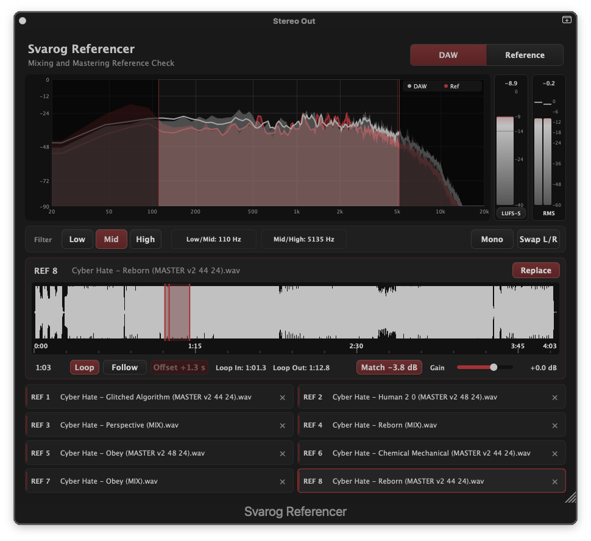

Svarog Referencer

A mixing and mastering reference tool for macOS and Windows. Load reference tracks, A/B them against your mix, and use the built-in filters, LUFS meter and spectrum analyser to hear what you need to hear.

Built/vibe coded with JUCE as a personal project. Shared because it might be useful to someone else.

Status
v0.1 — early, unsigned

Formats: AU, VST3 (macOS), VST3 (Windows)

Tested with: Logic Pro.

What it does:

Load up to 8 reference tracks and switch between them instantly.

Follow mode: keeps the reference in sync with your DAW's transport, with an adjustable offset, or let it free-run, or catch a loop section.

Filter: solo the low, mid or high band to compare frequency ranges between your mix and the reference.

LUFS meter: short-term, momentary and integrated, for level-matched comparisons.

Match: measures the DAW's loudness and adjusts the reference's gain to match it.

Spectrum analyser with a DAW trace and a Reference trace drawn on top of each other.

Mono fold and L/R swap.

Installation:

Download the latest macOS .pkg or Windows VST3 from the Releases page.

Installation (macOS):

Double-click the .pkg and follow the installer.

macOS will warn you that the package is from an unidentified developer. Open System Settings → Privacy & Security, find the message about Svarog Referencer.pkg, and click Open Anyway.

Run the installer to completion. It will place the AU and VST3 in the correct system folders.

When macOS blocks the plugin with a "cannot be opened" message, run this in Terminal:

sudo xattr -cr "/Library/Audio/Plug-Ins/Components/Svarog Referencer.component"
sudo xattr -cr "/Library/Audio/Plug-Ins/VST3/Svarog Referencer.vst3"

Then restart DAW.

Uninstallation

sudo rm -rf "/Library/Audio/Plug-Ins/Components/Svarog Referencer.component"
sudo rm -rf "/Library/Audio/Plug-Ins/VST3/Svarog Referencer.vst3"

Installation (Windows):

Download the latest Windows .zip from the Releases page and unzip it.

Copy Svarog Referencer.vst3 to:

C:\Program Files\Common Files\VST3
Windows might ask for administrator permission. Click Continue.

If the plugin doesn't appear in your DAW, unblock it: right-click Svarog Referencer.vst3, choose Properties, tick Unblock at the bottom of the General tab, then click OK.

Open your DAW and rescan plugins. In most DAWs this is in the plugin preferences or settings menu.

Basic usage

Insert Svarog Referencer on Stereo Out/Monitoring output.

In the plugin, click + Add reference to add a slot, then load an audio file into it.

Play your DAW. Use the DAW / Reference toggle at the top right to switch between your mix and the reference.

Use Match to level-match the reference to your mix, or Follow to keep the reference synced to your DAW's timeline.

The filter bar lets you solo the low, mid or high band. Useful for hearing whether your low end is in the same ballpark as the reference.

Known limitations

Unsigned build. The plugin is not code-signed or notarized. macOS will warn you on first install, and you may need to allow it in Privacy & Security and/or run the xattr command above.

Latency. The plugin reports 512 samples of latency to the host. Logic and other DAWs compensate automatically via Plugin Delay Compensation. This is used to smooth some internal state changes.

Personal project. I'll fix what I can when I can, but there's no support commitment.

Feedback
Open an issue on GitHub

If you're reporting a bug, please include:

macOS version

DAW and version

Plugin format (AU or VST3)

A short description of what you did and what happened

License
Copyright (c) 2026 Šime Alavanja, Svarog Studio

Permission is granted to use this software for personal and commercial purposes. Redistribution in source or binary form, with or without modification, is permitted provided this notice is retained. This software is provided "as is", without warranty of any kind.
